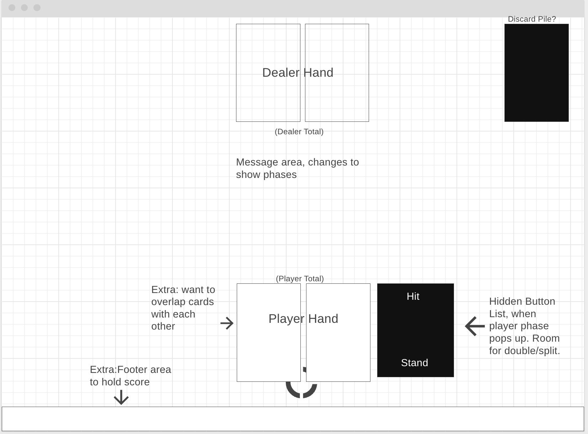

# Blackjack Card Game ♦️♣️♥️♠️

# Play the Game
Hardcoded for 1600x900 at the moment:
- [https://euril-blackjack.surge.sh/]
<!-- start of description -->
# Blackjack 🂮🃁
My game is a somewhat faithful representation of Blackjack. The goal of the game is to beat the dealer by getting as close to a total of 21 without going over 21. Each card of a standard 52 card deck has a value, number cards have their own respective value. Face cards are worth 10 and the Ace is worth 1 or 11.  
The player goes first drawing cards to get as close to 21, then the dealer goes doing the same thing. The two then compare the total value of their drawn cards and whoever is closer to 21 wins. However when drawing cards if the total goes over 21 you immediately lose *"Bust"*. The rules are simple, the play is thrilling, and there is opportunity for high strategy.   
At the start of each round the player makes a bet 100p, 500p, or 1000p from there the game is played. The player gets 2 cards and the dealer gets 2 cards with the second card back-side faceup obscuring its value. The player then gets to either *Hit*,*Double*,or *Stand*. 
- **Hit**: Player draws 1 card from the deck and adds that value to their hand. The player can continue hitting as long as the hand value doesn't go beyond 21.
- **Double**: Only selectable when the first two drawn cards total equal to 9, 10, or 11. When selected you double your bet and only draw 1 card to add to the hand.
- **Stand**: Player ends their turn.
<!-- end of the list -->
After the player turn the dealer then gets their turn, difference is that the dealer must keep hitting if they are under or equal to 16 and must stand once they are above or equal to 17. Once both player and dealer get a turn and neither have gone beyond 21 the totals are compared whoever is closer to 21 is the winner. Bets will then be payed out depending on who won and the board will be cleaned, used cards will be discarded. 
My Blackjack game uses 6 decks for a total of 312 cards, once below 50% the deck will be reshuffled. 

# Technologies Used 

# Credits 
SVG generator
[https://sean.brunnock.com/SVG/SVGPathGenerator/] 
Curved text guide
[https://css-tricks.com/snippets/svg/curved-text-along-path/] 
Gradient text guide
[https://fossheim.io/writing/posts/css-text-gradient/] 
Gradient maker
[https://cssgradient.io/] 
Deal card audio
[https://freesound.org/people/egomassive/sounds/536784/] 
Slide card audio
[https://freesound.org/people/el_boss/sounds/571574/] 
Clapping audio
[https://freesound.org/people/timtube/sounds/57733/] 
Tada fanfare G
[https://freesound.org/people/plasterbrain/sounds/397353/] 
Casino chip audio
[https://freesound.org/people/strangehorizon/sounds/618760/] 
MichaelNo audio from The Office 
[https://www.voicy.network/clips/NVurDahoEeihTtSuUqiQGg] 
Confentti courtesy of https://github.com/mathusummut/
[https://github.com/SEI-Remote/confetti] 
Animate
[https://animate.style/]
CSS cardstarter from GA
[https://github.com/SEI-Remote/flippin-awesome-improved]

# Ice Box / Stretch Goals
- [x] Sound effects
- [ ] Card Animation
- [ ] Dealer portrait that updates depending on what is going on
- [ ] Show the deck and discard deck for continuity sake
- [ ] Mobile accessibility
- [ ] More players or basic AI players to add more authenticity
- [x] Betting
- [X] Chip Image for bets
- [x] Double
- [ ] Split / Surrender / and even maybe Insurance
- [ ] Add Fisher-Yates Shuffle or other shuffle if better

# Designing

Original wireframe, definetely thought simple.
[https://trello.com/b/L9ryi2dz/euril-blackjack]

Hope you liked my version of blackjack, I enjoyed thinking out how to translate playing the game into javascript code. I went out of my way to mimic a blackjack table, I made the background using the gradient tool then bringing that into a clone of my code to make things show up where I wanted them to. I really like how the curved text/lines turned out. My inspiration came from games I've played blackjack in as I've never actually played Blackjack in a casino before. Shoutout to the *Yakuza* series and *Fallout: New Vegas*.
